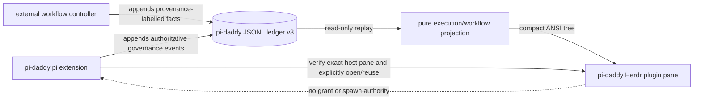

# ADR-0036: the dashboard is a ledger projection hosted by Herdr

**Date:** 2026-08-28
**Status:** Accepted (2026-08-28, implementation mandate in the product brief)
**Driver:** the requested live governance tree; ADR-0008's audit signal; ADR-0018's privacy boundary;
ADR-0032's in-call observability; ADR-0034's closed v2 contract and non-authoritative correlation.

## Context

The operator can watch one delegation's bounded output inside pi, and `/grants ledger` can count events after
the fact. Neither surface answers the live structural question: which governed executions are active, which
refused, how they are related, and which workflow labels are declarations rather than enforcement facts.
Herdr is the intended host and now has a v1 plugin mechanism (measured locally at Herdr 0.8.0, client/server
protocol 19): a globally linked manifest can launch a plugin-owned split targeted at an exact pane with
`--no-focus`.

The forcing correctness defect is identity. `childId` such as `d0.1` is a readable logical position, not an
occurrence: every plain `delegate` call reuses it, and two concurrent tool calls may therefore emit lifecycle
records with the same value. Joining on it can combine one child's decision with another child's completion.
The published v2 schema is closed, so adding occurrence identity to it is forbidden by ADR-0034's third
amendment.

The privacy and authority boundaries remain fixed:

- the ledger is the only execution database;
- no task text, prompt, tool arguments, child output or tool results enter the dashboard path;
- correlation labels are caller-declared and never prove a workflow transition;
- a planned phase, observed inline invocation, controller-validated transition and pi-daddy-enforced child are
  four different facts;
- the plugin reads and renders. It never grants, approves, spawns, repairs a ledger, or becomes an enforcement
  point.

**Assumed MVP load:** at most eight active children, up to 10,000 ledger lines / 10 MiB, and a 250 ms display
refresh. The pure projection must reconstruct from a complete ledger after restart. If full reconstruction
exceeds 100 ms p95 or a normal ledger reaches 50 MiB, incremental offset/inode tracking replaces whole-file
rereads without changing the event or projection contracts.

## Options considered

### Option 1 — a static `/grants tree` inside pi

Parse the ledger on demand and print a compact snapshot with no Herdr plugin.

**Buys:** smallest implementation, no installation handshake, no second process. **Misses:** the persistent
right split, live updates while pi is busy, pane reuse, and the primary user experience. It remains a possible
fallback, not the product surface.

### Option 2 — a package-shipped Herdr plugin over a pure ledger projection (chosen)

Ship one Herdr manifest inside the trusted `pi-daddy` package. The extension verifies its own Herdr pane and
foreground pi PID, explicitly offers to link the plugin, and opens or reuses a plugin-owned right split. The
pane runs a Node terminal renderer over a pure `JSONL -> projection` function.

Add ledger v3. Every governed occurrence has a random `executionId` and explicit
`parentExecutionId: string | null`; `childId`/`parentId` remain as readable logical positions. Lifecycle and
lease events join only by execution ID. A starting event carries a deadline, and a Herdr running event may
carry pane and agent names. v2 remains readable but is rendered historical/unjoinable; its lifecycle is never
guessed onto a same-named child.

Add an identifier-only `workflow_fact` event with provenance `planned | observed | controller_validated`.
Enforced children remain capability/lifecycle events and cannot be minted through that builder. Principal
runs receive generic rich labels from existing correlation (`run_id`, `phase`, effective assurance and an
explicit `policy_label`) and may append provenance facts through the same ledger. No principal workflow graph
is parsed from prompts or prose. A future principal declaration must be generated by principal-pi-skills from
its own source contracts; pi-daddy will consume that machine contract rather than own a duplicate graph.

**Buys:** the requested experience, restart reconstruction, no second execution store, testable interpretation,
and explicit provenance. **Costs:** a new public ledger version, one global plugin registration, a persistent
pane-handle file, and a small polling process per open dashboard.

### Option 3 — stream extension state directly to the plugin

Have the extension publish an in-memory socket/RPC feed and let the plugin maintain its own state.

**Buys:** lower latency and no ledger reread. **Costs:** restart recovery requires a second database or replay
protocol; plugin availability begins affecting the extension; dropped messages disagree with the audit trail;
and the pure projection seam disappears. Rejected because it makes presentation a participant in governance
state.

## Decision

Choose Option 2.

- Layering is `ledger events -> pure execution/workflow projection -> terminal renderer`.
- Ledger v3 is a new closed, packaged schema and fixture set. v2 artifacts are frozen.
- `executionId` is the only lifecycle/lease occurrence join. `childId` is display data.
- A non-terminal start is live only until its recorded deadline; afterwards it is incomplete.
- Herdr host verification requires complete pane environment, a matching `pane.current`, and this pi PID in
  `pane.process-info`. Server reachability alone never counts.
- `/grants dashboard` requires a configured ledger, diagnoses missing/disabled/incompatible plugins, opens a
  right split targeted at the calling pane with `--no-focus`, and reuses a persisted pane identity under a
  cross-process lock.
- Installation is explicit. On first meeting, a Herdr-hosted TUI offers exactly **Install and open / Not now /
  Never ask**. Only the first selection runs `herdr plugin link`; the other choices are persisted. The command
  never installs an absent plugin silently and prints the exact link command.
- Plugin/core dashboard protocol is version 1. An incompatible major renders no guessed tree.
- Workflow facts carry identifier vocabularies only. Planned, observed and controller-validated facts get
  distinct markers; enforced execution remains a separate event class.

## Amendment — completed whole-change review (2026-08-28)

The first completed review requested changes on eight boundaries. They narrow and enforce this decision; none
changes the chosen architecture:

1. `PI_GRANTS_LEDGER` is resolved once against the root pi session's actual cwd and propagated as an absolute
   path. Otherwise a routed child changed cwd and its descendants disappeared into another file, contradicting
   the premise that the ledger is the one execution database (R-141).
2. A chain step emits one capability decision for its one execution ID. Several capability dialogs are merged
   into that decision; they are not several executions (R-161).
3. Runtime v3 validation is one shared, content-free boundary for `verifyLedger` and dashboard projection.
   Neither parser diagnostics nor unknown field names quote raw ledger bytes, and malformed nested correlation
   is corruption rather than a renderer exception (R-162).
4. Public workflow-fact builders check every finite vocabulary at runtime. TypeScript unions are not a wire or
   privacy boundary for JavaScript consumers (R-163).
5. Progress callbacks are presentation only even when called from a security-sensitive process-spawn hook;
   their exceptions cannot stop a child or suppress the runtime observation (R-164).
6. Plugin root and protocol are verified before enabled state, so no diagnostic asks an operator to enable a
   same-id plugin from another package (R-165).
7. Only literal menu choices are persisted. Dismissal/timeout installs nothing **and stores no invented Not now
   choice** (R-166).
8. The malformed-input privacy regression uses a secret-bearing line and checks both projection and final
   render. Testing only a hand-written safe reason did not exercise the boundary the prose claimed.

Each item has a red-first regression and a pinned mutation; a new review is required over these repairs before
merge because the repairs themselves are a new change.

**Correction from the second review:** item 3 overstated the first repair. The dashboard parser stopped quoting
raw content, but `verifyLedger` still retained 120 raw bytes and `/grants ledger` printed them. The decision is
unchanged; the implementation did not yet satisfy it. R-162 preserves that failed claim and its dated repair.

## Second amendment — critical re-review (2026-08-28)

The required re-review returned CHANGES-REQUESTED again. Ten findings reduce to four boundaries:

1. **Content-free means every first-party report.** `LedgerReport.corrupt` carries line + fixed reason, never a
   byte slice. `/grants ledger`, session start and the dashboard now share that limit (R-162).
2. **A reuse key remains true at reuse time.** A stored pane is reusable only while Herdr reports it in the
   verified caller workspace and tab; a wrong-host result from open is closed and rejected; every nested v1
   pane-store entry is validated before use. Complete identity is not matching identity (R-167).
3. **Identifier-only is a runtime and terminal boundary, not a TypeScript comment.** V3 display and capability
   fields have closed ASCII grammars in schema/runtime/builders; model-facing correlation label fields reject
   prose; frozen v2 values outside that grammar are redacted. The terminal removes every Unicode `Cc` and
   `Cf`, including C1 and bidi controls (R-168).
4. **One lifecycle has one clock and one append order.** The strict starting append consumes the recorded
   deadline budget, executors receive only the remainder, and a terminal append waits for a pending running
   append. Builders use the exact RFC-3339 validator; top-level null `assurance_scope` is excluded consistently;
   public v3 builders assert their JSON wire form against the closed runtime contract (R-169, R-170).

These repairs have independent regressions and mutation entries. They require a third review: the second pass
proved that a prior APPROVAL target can become a new change without becoming approved.

## Third amendment — bounded critical adjudication (2026-08-28)

Broad whole-change reviewers again timed out, so this was not the required approval. A fresh critical snapshot
nevertheless reproduced two more blockers in the second amendment's strongest claims:

1. **Pane identity is exactly workspace/tab/ledger.** The implementation also hashed invocation `cwd`, so the
   same host and ledger opened from another directory created a second dashboard. `cwd` still controls the
   initial process directory, but is not pane identity; a regression requires one open and subsequent reuse
   across different invocation directories (R-167).
2. **Every public v3 builder means every builder.** Execution-event builders asserted their serialized wire,
   but `buildWorkflowFactEvent` did not. A JavaScript caller supplied a Date-shaped value whose `toISOString()`
   returned `"1"` and received an event the canonical reader rejected. The workflow builder now applies the
   same final wire assertion, including to its timestamp (R-170).

Both repairs were driven by the independent reproducers and have pinned mutations. Because the review was
explicitly bounded and non-exhaustive, they still require a complete critical whole-change review before merge.

## Fourth amendment — distributed critical whole-change review (2026-08-28)

Three independent slices covered every changed path and test at candidate tree `61bcd58…`; a fourth snapshot
adjudicated all five reported hypotheses. Two were accepted:

1. **A key and its stored value must agree.** The v1 pane shape was valid even when the entry under a
   workspace/tab/ledger key named another `ledgerPath`; a live pane was then reused for the wrong requested
   ledger. Stored workspace, tab and resolved ledger must match the request before a pane command (R-167).
2. **Historical does not mean unvalidated.** Explicit v2 events were adapted before the frozen v2 contract was
   checked. Missing required identity became a plausible historical node or an orphan count instead of a
   corrupt line. The exact published v2 schema now gates historical projection; v2 lifecycle remains unjoined
   and the artifact remains byte-for-byte frozen (R-171).

Three hypotheses were rejected rather than converted into work: persisted installation choices are not scoped
to the plugin protocol by this decision; production progress reporters already isolate the internal callback
reproducer; and the documented 460-character check-ID limit is a valid conservative ceiling. The two accepted
repairs have red-first regressions and pinned mutations. They are a new review target and therefore still need
approval before merge.

## Fifth amendment — critical retry (2026-08-28)

The approval retry returned CHANGES-REQUESTED on three more load-bearing divergences:

1. **One v3 timestamp profile.** JSON Schema `date-time` accepted leap-second strings while runtime validation
   rejected them and JavaScript date arithmetic cannot represent them. The canonical v3 schema now shares one
   timestamp definition with the runtime-supported seconds `00`–`59` profile; all seven timestamp-bearing
   schema sites have a parity regression (R-170).
2. **One occurrence cannot move its deadline.** Projection previously trusted the latest non-terminal event's
   `deadlineAt`, so a structurally valid `running` line could replace the starting bound and make an expired
   child look live. A changed deadline is now content-free corruption and projection remains anchored to the
   first recorded bound (R-169).
3. **The deadline is the hard-kill bound.** The process timer sent SIGTERM at `deadlineAt` and only then began
   the default five-second SIGKILL grace. A measured SIGTERM-ignoring child remained live 5.015 seconds past
   the dashboard's bound. SIGTERM grace is now reserved inside the remaining budget and an independent hard
   timer sends SIGKILL no later than the recorded deadline (R-169).

Each accepted finding has a red-first regression and pinned mutation. These repairs are another unapproved
review target; CHANGES-REQUESTED remains in force.

## Sixth amendment — hard-deadline race (2026-08-28)

The fifth-repair specification review approved, but adversarial quality review found one race in the new hard
timer. A governed PID can exit successfully while a detached descendant retains its stdout/stderr pipes;
`close` then lags `exit` until the existing 100 ms settlement fallback. The hard timer could fire in that gap,
set `timedOut: true`, and turn an observed `code: 0` execution into `CHILD_TIMED_OUT` even though the governed
process was already gone.

The timer now checks the governed child's `exitCode`/`signalCode` before changing timeout state or sending
SIGKILL. The hard deadline bounds a live governed PID, not pipe drainage after it exits. A deterministic
retained-pipe regression positions successful exit 50 ms before the deadline and a mutation removes only this
guard. This repair requires fresh approval.

## Seventh amendment — pending exit delivery (2026-08-28)

The sixth-repair review found the same false timeout through two paths. The soft timer still changed state
unconditionally during retained-pipe drainage. More subtly, after the controller event loop was blocked across
a deadline, its timer phase could run before libuv delivered an OS exit; `exitCode` and `signalCode` were still
null even though the child had completed hundreds of milliseconds earlier.

Both deadline callbacks now pass through one helper that defers control by one event-loop turn, allowing pending
child-process exit delivery first, then checks completion before changing `timedOut` or signaling. A live PID
still receives SIGTERM and absolute-deadline SIGKILL. Separate regressions force soft-timeout drainage and the
delayed-event-loop ordering; mutations force both the completion check and the event-loop turn.

## Eighth amendment — path-specific proof (2026-08-28)

The seventh-repair quality review approved production behavior, but specification review found the delayed-exit
claim mechanically forced only through the hard callback. The soft test covered prompt exit delivery and the
shared helper was tested under delay through another caller; neither proved that the soft callback itself kept
using that helper. A new regression blocks the controller across the soft timeout, and a mutation bypasses only
the soft callback. Production code is unchanged; this closes the proof gap rather than changing semantics.

## Ninth amendment — deterministic deadline proof (2026-08-28)

The proof repair's quality review found its busy-spin scheduled the child and controller competitively, so a
slow child could legitimately miss the fixed 500 ms timeout and make a correct implementation look broken. The
soft and hard delayed-delivery tests now share a child-ready handshake: the child flushes `READY` immediately
before exiting, and only then does the controller sleep across the deadline with `Atomics.wait`. This blocks no
CPU core. The soft-only mutation still fails the synchronized test.

## Tenth amendment — readiness before the tested clock (2026-08-28)

The ninth test still computed its deadline before `READY`; a child delayed more than two seconds made the sleep
a no-op and restored the arbitrary startup window under another number. The child now writes a file-based
ready marker from inside the real spawned process. `onSpawn` waits without spinning, then establishes the soft
clock or absolute hard deadline, releases the child to flush `EXITING`, and only that output callback sleeps
across the bound. This attempted repair read the optional hard deadline after `onSpawn`; the eleventh amendment
rejects that production mutability and replaces the hard-route proof.

## Eleventh amendment — immutable hard deadline, observed OS exit (2026-08-28)

The tenth repair weakened the API's structural guarantee: `onSpawn` could delete, extend or invent the hard
deadline after process creation. A review reproduced an initial 100 ms bound disappearing and the child exiting
normally after 536 ms. `runChild` again snapshots `hardDeadlineAt` before spawn.

The hard-route test no longer mutates production input. Its child starts a detached observer, is released only
after readiness, and exits. While the controller remains synchronously inside `onSpawn`, the observer reads the
Linux process state and records only `Z` or disappearance. The controller then returns, allowing the already-due
hard callback and pending libuv exit delivery to race in the required order. The soft route still establishes
its timer after readiness because soft timers are scheduled after `onSpawn`. Both route mutations remain red;
production's hard boundary is immutable again.

## Twelfth amendment — force the snapshot and bound the observer (2026-08-28)

The eleventh repair restored the snapshot but did not force it: moving the read after `onSpawn` stayed green
because the observer test never mutated the request. A dedicated real-child regression now deletes the request
property in `onSpawn`; the original bound still sends SIGKILL. A two-site mutation moves the snapshot read after
the hook and makes that named test fail.

The detached observer is also fail-closed and independently bounded. Only Linux zombie state or `ENOENT`
records `exited`; unsupported platforms fail explicitly, other `/proc` errors record an error, and a nine-second
observer deadline records `timeout`. The controller requires the exact `exited` marker, so neither errors nor
observer expiry can create a false proof or an indefinitely polling orphan.

## Thirteenth amendment — exit precedes the hard bound (2026-08-28)

The twelfth hard proof made its deadline due before spawn, then required an eventual exit to remain successful.
That contradicted the lifecycle contract: pending event delivery can preserve an exit observed by the OS before
the bound, but cannot turn a post-deadline exit into success. The proof now gives the real child a future hard
epoch and releases the ready child. Its `EXITING` output blocks controller delivery across that epoch while a
detached observer records the time the OS reached zombie state or disappearance. After the wait, the test
requires that observation to predate the epoch before permitting the overdue hard callback and pending libuv
exit delivery to race. The controller therefore proves the exact ordering production promises without
overriding deadline truth.

Observer status publication now writes a same-directory temporary file and renames it atomically. Existence
therefore implies a complete `exited:<epoch>`, `timeout`, or `error:*` status; the controller cannot read a
partial marker.

## Fourteenth amendment — readiness-gated test clock (2026-08-28)

The thirteenth proof still consumed a five-second pre-spawn window, assumed `EXITING` occupied one stream
chunk, and could leave its temporary status file after publication failure. The test now uses a package-internal test
control entry point that selects a hard epoch immediately after `onSpawn` has observed readiness. Public
`runChild` still snapshots only the caller's pre-spawn deadline; the direct mutation guard continues to force
that production path. The deadline callback, process-state control and settlement logic are shared, so the
hard-callback mutation remains exact while the proof takes under one second rather than 5.3 seconds.

Output synchronization buffered a bounded suffix across callbacks before matching `EXITING`. Observer
publication attempted temporary cleanup in `finally`. The fifteenth amendment corrects both mechanisms and
the claimed package-internal boundary.

## Fifteenth amendment — unexported control and complete-status polling (2026-08-28)

The test-control function was exported from the supported `./run-child` package path, so it was public despite
its name. Control now lives in a separate AsyncLocalStorage module that is absent from package `exports`;
public `runChild` consults the current internal context, and the test scopes it around one invocation. A
mutation removes that consultation and the hard proof fails, while the independent snapshot mutation still
forces production request immutability.

The marker matcher now searches combined old/new input before retaining only the six-character overlap suffix;
a deliberately split child write and mutation that inspects only the latest chunk force this behavior. Observer
publication no longer needs temporary files: it writes a newline-terminated status, and the controller polls
until a complete terminal grammar is present. Partial content cannot establish exit, and there is no cleanup
branch or stale temporary artifact to trust.

## Sixteenth amendment — adversarial internal-protocol proof (2026-08-28)

The fifteenth behavior worked but only on its normal synchronous observer write and one controlled invocation.
The status poller is now a deterministic helper with injected read/clock/wait functions. Tests force partial
then complete status, complete `timeout` and `error:*`, transient read failure, permanent read failure and
expiry. A mutation loosens the terminal grammar so partial `exited` content returns early and fails its named
test.

AsyncLocalStorage tests run controlled and uncontrolled children concurrently in one process, nest an inner
control and verify restoration of the outer one, reject a scope, and run again after settlement. These force
isolation, nesting and cleanup rather than inferring them from one happy-path invocation.

## Seventeenth amendment — bounded polling and test-only ownership (2026-08-28)

The deterministic poller could still loop forever when both injected clock and wait were inert. It now has an
independent attempt ceiling as well as an epoch limit; a frozen-clock regression proves it returns after the
configured attempts.

The AsyncLocalStorage implementation moved entirely under `test/`. Production `run-child.ts` contains only a
private lookup guarded by Node's `NODE_TEST_CONTEXT=child-v8`; no test-control source or compiled module is part
of the package. Build removes `dist/` before compilation so deleted internal modules cannot survive as stale
artifacts, and installed-package smoke refuses the former control filename. A two-party barrier now suspends
controlled and uncontrolled scopes before either child starts, forcing genuine overlap; nested restoration,
rejected scope and post-settlement cleanup remain separate checks.

## Consequences

**Positive**

- Two concurrent/repeated `d0.1` delegations cannot merge visually or in downstream consumers.
- A refusal with no process is visible, while an abandoned start becomes incomplete.
- The dashboard restarts from the ledger and never needs pi's in-memory state.
- Principal correlation enriches labels without making principal policy pi-daddy policy.
- Herdr remains presentation and navigation, not a security boundary.

**Negative**

- **[ONE-WAY] Ledger v3 is public wire API.** Once a ledger contains v3, a v2-only consumer correctly refuses
  those lines. Rollback is to stop writing new events and run without the dashboard; never rewrite or downgrade
  the audit file. v2 and v3 readers coexist.
- **[ONE-WAY] `pi-daddy.dashboard` and protocol major 1 are globally visible plugin identities.** Rollback is
  `herdr plugin unlink pi-daddy.dashboard`; workspace ledgers and enforcement are untouched.
- Whole-file polling is deliberately boring and has the load threshold above.
- Pane persistence uses a small handle registry. It is not an execution database and corruption refuses a
  duplicate-safe open rather than guessing.
- Existing v2 lifecycle cannot be safely reconstructed into occurrences and therefore appears grey/historical.

**Deliberate non-goals**

- VS Code, a workflow engine, task/output capture, model compliance inference, path containment, `bash`
  containment, or making a dashboard mandatory outside Herdr.
- Inferring an inline skill execution from discovery/read, or a completed phase from a planned graph.
- Reading principal prompt prose to discover its workflow.

## Critical validation and observability

- Closed v3 schema/fixtures are generated through production builders and imported by installed-package smoke.
- Unit tests force repeated logical IDs, explicit parent identity, refusal-without-start, stale-start
  incompleteness, restart replay, corrupt-line reporting, provenance separation, no-focus/right-split args,
  PID-bound host verification, duplicate reuse, installation choices and protocol mismatch.
- The existing load-bearing capability append remains strict; terminal observations remain best-effort/loud.
- The mutation catalogue pins the new identity, projection, host, focus, handshake and contract guards.

## Revisit trigger

- Projection p95 above 100 ms or ordinary ledger above 50 MiB: switch the reader to incremental replay.
- Herdr exposes a stable plugin-pane query by owner/entrypoint: replace the local pane-handle registry.
- principal-pi-skills publishes a generated workflow declaration: add an adapter for it, preserving provenance
  and refusing graph/prose inference.
- A controller needs a new provenance class: version the ledger; do not overload one of the three.

## Diagram

