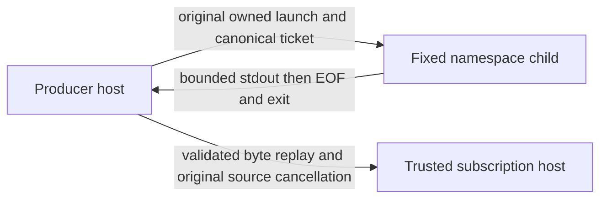

# ADR-0059: An original reservation owns a separate IPC bridge

**Date:** 2026-09-09
**Status:** Accepted (local implementation; integration and acceptance pending)
**Driver:** Explicit producer IPC task: an existing experiment reservation must correlate one actual
child invocation frame with one frozen host charter, without widening ADR-0046/0051's fixed profile.

## Context

The trusted harness owns subscription approval, SDK binding, payload and transport. It accepts one
canonical bounded `{id,sequence:1}` frame through a terminating Node Readable; its global claim ordinal
is different. A parent-authored frame would not establish actual producer child IPC. A copied reservation,
PID, source hash or completed output is not an original lifetime/settlement capability. The original
whole-change review and native seq226 remain unaccepted. No live model execution is authorized here.

## Options considered

### Option 1 — Call the host with a parent-authored frame
Smallest adapter, but misses the actual child IPC driver and could disguise a prepared frame as an
observed child effect. Retain this only as an explicitly inert host fixture, not the producer bridge.

### Option 2 — Extend the fixed digest profile with SDK or socket access
Would let a persistent child request and receive model data, but changes the fixed operation's meaning
and exposes new credentials/transport/runtime choices. Rejected: it contradicts the bounded task.

### Option 3 — One separate fixed emitter and serial original host exchange
Use the existing original resource owner/permit and `runChild`, unchanged namespace/binary guards and a
new fixed emitter. Require exact bounded bytes, original EOF and original child completion before handing
a one-use replay stream to the original host port. Hold the existing reservation until the invoked host
and required accounting also acknowledge. This meets the driver without a socket, scheduler or new journal.

## Decision

Choose option 3. `producer-ipc-v1` binds one original v4 permit's canonical input digest to the parent
budget/order/experiment/execution/charter/invocation binding. Cumulative byte accounting covers that whole
binding, not just the smaller child frame and not provider input. The frozen original host port receives
only the validated actual frame stream plus parent-only binding/composed original cancellation. It returns
bounded evidence references, never policy or votes. The existing public permit can no longer settle early
after exclusive handoff. No bridge path reserves a replacement, retries a host call or recovers ownership.

## Consequences

Positive: actual child mechanics are independently correlated with existing durable reservation counters;
malformed/repeated frames cannot trigger prefix dispatch. Observation timeout and late host evidence cannot
release a still-unknown original lifetime or upgrade a failed effect. Required accounting failures remain
visible despite complete bytes and successful worker output.

Negative: exchange starts **after** the emitter exits. This is not a persistent/bidirectional subject or
containment of host/SDK/model execution. A non-acknowledging host or blocked filesystem operation can retain
capacity indefinitely. Host references are not authenticated by the producer, and a trusted callback must
not acknowledge until its I/O is settled. There is no cross-process/module-copy recovery. Existing fixed
experiment charters do not automatically schedule this new explicit library API.

The host retains independent charter/approval/transport/invocation accounting obligations. Local inert
behavioral tests are not live qualification, Ubuntu24 support, a cause for historical namespace denials or
P01 acceptance. No runtime/profile/security installation, ordinary extension permission or provider route
is changed. See the [contract](../../packages/pi-daddy/contracts/producer-ipc/v1/README.md) for callable APIs,
mandatory completion predicates, tested faults and explicit exclusions.

## Revisit trigger

A concrete authorized workload needs a persistent child response channel, crash recovery, automatic
P11 scheduling, or proof that remote host work has stopped rather than a promise acknowledgement. Each
requires a new lifetime/authority protocol and its own behavioral proof; do not relax this frame or fixed
profile. Rollback is to stop opting into this new API, not erase charged reservations or pending lifetimes.
